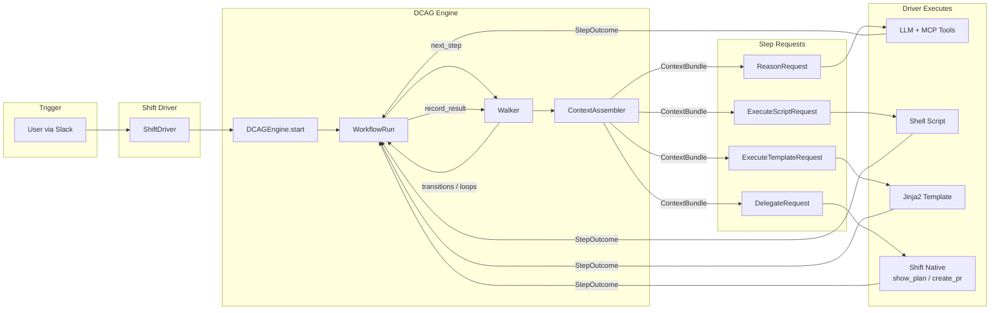

# DCAG — Data Context Abstraction Graph

Headless workflow engine for AI-assisted data engineering.

---

## What is DCAG?

DCAG structures how AI assistants investigate and resolve data engineering problems. It defines workflows as YAML with mandatory steps, structured outputs, and dynamic context injection.

The core loop: `engine.start(workflow_id, inputs)` returns a `WorkflowRun`. Calling `run.next_step()` returns a typed `StepRequest`. The driver executes it and calls `run.record_result(step_id, outcome)`. The engine advances via transitions and loops. Repeat until done.

Key constraint: DCAG makes NO LLM calls itself and has no external runtime dependencies beyond YAML parsing. The engine is a pure orchestrator. Drivers handle all execution.

## Architecture



See [docs/architecture.md](docs/architecture.md) for deep dive.

## Available Workflows

### Analytics Engineer

| Workflow | Triggers | Model | Steps |
|----------|----------|-------|-------|
| `triage-ae-alert` | `triage`, `on-call`, `debug alert` | Full orchestration | 13 (4-way branch) |
| `fix-model-bug` | `fix bug`, `model failing` | Full orchestration | 8 (3-way branch) |
| `add-column-to-model` | `add column`, `new column` | Full orchestration | 9 |
| `add-dbt-tests` | `add tests`, `test coverage` | Full orchestration | 7 |
| `generate-schema-yml` | `generate schema`, `document model` | Full orchestration | 6 |
| `create-staging-model` | `create staging`, `new source` | Full orchestration | 8 |
| `thread-field-through-pipeline` | `thread column`, `propagate column` | Full orchestration | 7 (2 loops) |

### Data Engineer

| Workflow | Triggers | Model | Steps |
|----------|----------|-------|-------|
| `create-etl-pipeline` | `create pipeline`, `new pipeline` | Guardrails | 11 (4-way branch + revision loop) |
| `table-optimizer` | `optimize table`, `clustering` | Full orchestration | 9 |
| `configure-ingestion-pipeline` | `add ingestion`, `new data source` | Full orchestration | 7 |

## Quick Start

```bash
# Prerequisites: Python 3.11+, just (brew install just)
git clone https://github.com/stubhub/StubHub.Data.Core.ContextAbstractionGraph.git
cd StubHub.Data.Core.ContextAbstractionGraph
just setup        # pip install -e ".[dev]"
just test         # pytest (361 passed, 1 xfailed, 2 skipped)
just api          # starts REST API on :8321
```

## Writing Your Own Workflow

This section walks through building a workflow from scratch.

### Workflow YAML Anatomy

```yaml
workflow:
  id: my-workflow
  name: Human-Readable Name
  persona: analytics_engineer
  inputs:
    param_name:
      type: string
      required: true
  steps:
    - id: step_one
      mode: reason
      instruction: |
        What the LLM should do...
      tools:
        - name: snowflake_mcp.execute_query
          instruction: "Why to use this tool"
      context:
        static: [knowledge_id]
        dynamic:
          - from: prior_step_id
            select: [field1, field2]
        decisions:
          - entity: "{{inputs.table_name}}"
        cache: [cache_key]
      output_schema:
        type: object
        required: [field1]
      budget:
        max_llm_turns: 5
        max_tokens: 10000
      transitions:
        - when: "output.type == 'error'"
          goto: handle_error
        - default: next_step
      validation:
        structural:
          - output_has: field1
      loop:
        over: "prior_step.items"
        as: "item"
```

### Step Modes

- **`reason`** — LLM reasoning. The driver receives a `ReasonRequest` with persona, instruction, tools, context, output schema, and budget. The LLM does the work.
- **`execute`** — Script or template execution. Returns an `ExecuteScriptRequest` (shell command) or `ExecuteTemplateRequest` (Jinja2 render).
- **`delegate`** — Driver-native capability. Returns a `DelegateRequest` for operations like `show_plan` or `create_pr` that the driver handles natively.

### Context Injection (Per Step)

Each step declares what context it needs. The `ContextAssembler` builds a `ContextBundle` from these sources:

- **`static`** — Knowledge YAML files loaded by ID (e.g., `alert_classification`, `clustering_guide`). These are domain reference material.
- **`dynamic`** — Prior step outputs with field-level selection. Use `from:` to name the prior step and `select:` to pick specific fields.
- **`decisions`** — Cross-run decision traces indexed by entity. Lets the engine recall what was decided about a table or model in previous runs.
- **`cache`** — Cached metadata from steps that set `cache_as:`. Avoids re-querying Snowflake for schema info already fetched.
- **Loop variable** — When a step runs inside a `loop`, the current item from `loop.over` / `loop.as` is injected automatically.

### Two Execution Models

**Full orchestration** — The engine walks every step in sequence, with tool gates controlling what the LLM can access at each step. Best for operational workflows (triage, monitoring, debugging) where each step must be validated before proceeding.

**Guardrails** — Context assembly feeds into one freestyle LLM step, followed by mandatory validation steps. Best for creative work (pipeline creation, code generation) where the LLM needs freedom but the output must conform to standards.

### Checklist for Adding a Workflow

1. Create `content/workflows/{id}.yml`
2. Create `content/workflows/{id}.test.yml` (mock step outputs for E2E tests)
3. Add entry to `content/workflows/manifest.yml`
4. Add `tests/test_conformance_{id}.py`
5. Add `tests/test_e2e_{id}.py`
6. Run `just test`

## REST API

| Method | Endpoint | Description |
|--------|----------|-------------|
| GET | `/api/v1/workflows` | List available workflows |
| POST | `/api/v1/runs` | Start a run; returns first step |
| POST | `/api/v1/runs/{run_id}/results` | Submit step result; returns next step |
| GET | `/api/v1/runs/{run_id}` | Get run status and trace |

Auth: HTTP Basic (set `DCAG_API_USER` and `DCAG_API_PASS` env vars). Auth is disabled when env vars are unset.

```bash
# Start a run
curl -u $DCAG_API_USER:$DCAG_API_PASS \
  -X POST http://localhost:8321/api/v1/runs \
  -H "Content-Type: application/json" \
  -d '{"workflow_id": "table-optimizer", "inputs": {"table_name": "DW.RPT.TRANSACTION"}}'
```

## Integration with Shift

DCAG integrates with Shift (StubHub's Slack AI assistant) via Level 1 (YAML-direct, tested) and Level 2 (REST API, built). See [docs/shift-integration-guide.md](docs/shift-integration-guide.md).

## Project Structure

```
src/dcag/
├── engine.py          # Entry point: DCAGEngine + WorkflowRun
├── types.py           # Type contracts: StepRequest, StepOutcome, ContextBundle
├── _walker.py         # DAG traversal, transitions, loops
├── _context.py        # Context assembly (static + dynamic + decisions + cache)
├── _loaders.py        # YAML parsing into typed dataclasses
├── _evaluator.py      # Transition expression evaluation
├── _validation.py     # Structural output validation
├── _trace.py          # JSONL streaming trace
├── _decisions.py      # Cross-run decision persistence
├── _registry.py       # Tool filtering by runtime capabilities
├── _snapshot.py       # Context snapshots for observability
├── _tokens.py         # Token estimation
├── api.py             # FastAPI REST wrapper
└── drivers/shift.py   # Shift integration driver

content/
├── workflows/         # 10 workflow YAMLs + test fixtures + manifest
├── knowledge/         # 25+ domain knowledge files
└── personas/          # analytics_engineer, data_engineer

tests/                 # 364 tests: conformance, e2e, unit, API, driver, integration
docs/                  # Architecture, integration guide, design specs, research
```

## Development

```bash
just setup             # Install with dev dependencies
just test              # Run all tests
just test-cov          # Tests with coverage report
just lint              # Lint with ruff
just fmt               # Format with ruff
just api               # Start dev API server
just test-conformance  # Conformance tests only
just test-e2e          # E2E tests only
just check             # Pre-push: lint + test
```

## Team

Owned by **Data Engineering** (@stubhub/data-engineering).
