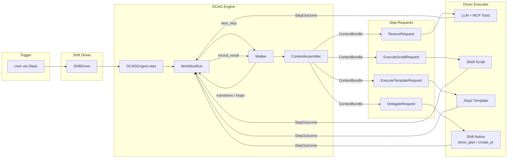
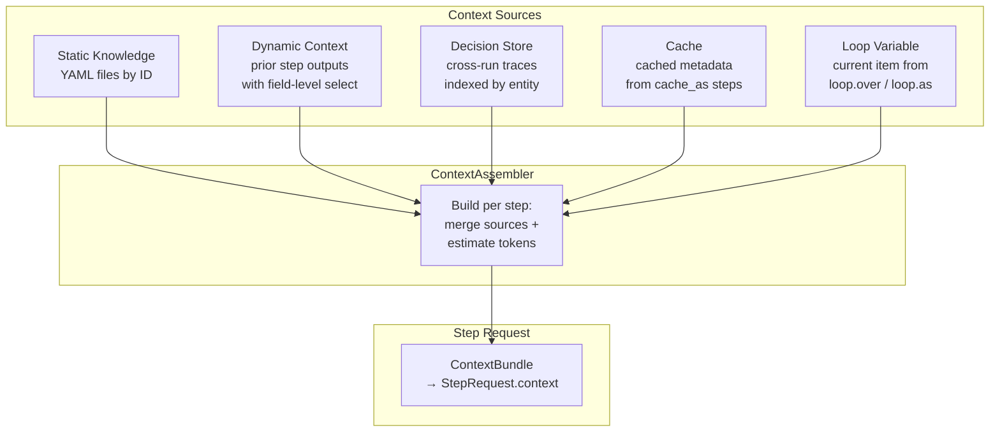

# DCAG Architecture

## System Overview



## Context Assembly (per step)



This document describes the internal architecture of the DCAG engine, its module breakdown, data flow, type system, and integration points.

## Module Breakdown

### `src/dcag/engine.py` -- DCAGEngine and WorkflowRun

The public API surface. Two classes:

**`DCAGEngine`**
- Constructor takes a `content_dir` path. Initializes `PersonaLoader`, `KnowledgeLoader`, and `WorkflowLoader` pointing at subdirectories.
- `start(workflow_id, inputs, decisions_dir=None)` -- Loads the workflow YAML via `WorkflowLoader`, resolves the persona via `PersonaLoader`, generates a unique `run_id` (`dcag-{uuid_hex[:8]}`), hashes all content files for a `config_snapshot`, creates a `ToolRegistry` and `ContextAssembler`, and returns a `WorkflowRun`.
- `list_workflows()` -- Returns `ManifestEntry` objects parsed from `manifest.yml`.
- `_hash_content()` -- SHA-256 of all `*.yml` files under `content_dir`, truncated to 12 hex chars.

**`WorkflowRun`**
- Owns: `Walker`, `ContextAssembler`, `TraceWriter`, `DecisionStore` (optional), `ToolRegistry`.
- Internal state: `_prior_outputs` (dict of step_id -> output), `_schema_cache` (dict of cache_as key -> output), `_status` (running/completed/failed/paused).
- `next_step()` -- Delegates to Walker for the current step. For `reason` steps, calls `ContextAssembler.assemble_reason()`. For `execute/script`, returns `ExecuteScriptRequest`. For `execute/delegate`, builds `DelegateRequest` with resolved dynamic inputs. Initializes loop items on first encounter of a loop step.
- `record_result(step_id, outcome)` -- On `StepSuccess`: runs structural validation (pauses on failure), stores output in `_prior_outputs`, updates schema cache, auto-populates ToolRegistry from capability keys (`dbt_available`, `dbt_mcp_available`, `github_available`, `fallback_mode`), records trace step, advances Walker. On `StepFailure`: records trace, sets status to `failed` or `paused`. On `StepSkipped`: records trace, advances Walker.
- `_persist_decisions()` -- Called on workflow completion. Extracts decision facts from the last step output and writes them to the `DecisionStore`.
- `get_trace()` -- Returns the consolidated JSONL trace as a dict.

### `src/dcag/_walker.py` -- Walker

DAG traversal engine. Supports three traversal modes:

1. **Linear** -- Default. Increments step index by 1.
2. **Conditional** -- Steps can define `transitions` with `when` expressions (evaluated by `_evaluator.py`) and `goto` targets. A `default` transition acts as a fallback. If no transition matches and no default is set, falls through to linear.
3. **Loop** -- Steps with a `loop` config iterate over a collection from a prior step's output. `set_loop_items()` initializes the loop; `advance()` moves to the next item until exhausted, then proceeds to the next step.

Key methods:
- `current()` -- Returns the current `StepDef`.
- `advance(step_output=None)` -- Evaluates transitions against `step_output`, or advances linearly.
- `is_complete()` -- True when index exceeds step count.
- `set_loop_items(items)` / `current_loop_item()` / `is_in_loop()` / `loop_variable_name()` -- Loop state management.

### `src/dcag/_context.py` -- ContextAssembler

Builds the full context for each reason step. Four context sources:

1. **Static** (`build_static`) -- Loads knowledge YAML files by ID via `KnowledgeLoader.load_multiple()`.
2. **Dynamic** (`build_dynamic`) -- Resolves references to prior step outputs. Supports:
   - `from: step_id` -- Includes full output of a prior step.
   - `from: step_id, select: field` -- Includes a single field. Supports dot notation for nested access.
   - `from: step_id, select: [field1, field2]` -- Includes multiple fields.
   - Graceful skip if referenced step did not execute (branch not taken).
3. **Decisions** (`build_decisions`) -- Loads decision traces from `DecisionStore` matching entity references. Supports `{{inputs.key}}` template variables.
4. **Cache** (`build_cache`) -- Loads cached metadata from `_schema_cache` by key.

`assemble_reason()` orchestrates all four sources, merges persona with step-level overrides (heuristics, anti-patterns, knowledge), filters tools through the `ToolRegistry`, estimates total token count, logs a warning if context exceeds 50% of budget, and returns a `ReasonRequest`.

### `src/dcag/_loaders.py` -- PersonaLoader, KnowledgeLoader, WorkflowLoader

YAML-to-dataclass loaders:

**`PersonaLoader`**
- `load(persona_id)` -- Reads `{personas_dir}/{persona_id}.yml`, returns `PersonaBundle`.
- `merge(base, step_heuristics, step_anti_patterns, step_knowledge)` -- Creates a new `PersonaBundle` with step-level overrides prepended (more specific first) to the base persona's lists.

**`KnowledgeLoader`**
- `load(knowledge_id)` -- Reads `{knowledge_dir}/{knowledge_id}.yml`, returns the `knowledge` key's contents.
- `load_multiple(ids)` -- Loads multiple knowledge files into a dict keyed by ID.

**`WorkflowLoader`**
- `load(workflow_id)` -- Reads `{workflows_dir}/{workflow_id}.yml`, returns `WorkflowDef` with parsed `StepDef` list.
- `load_manifest()` -- Reads `manifest.yml`, returns `ManifestEntry` list with trigger keywords and input patterns.
- `_parse_step(raw)` -- Converts raw YAML dict to `StepDef`. Determines `execute_type` from presence of `template`, `script`, or `delegate` keys. Parses `ToolDirective` list, `Budget`, and context references.

### `src/dcag/_evaluator.py` -- Expression Evaluator

Evaluates conditional transition expressions. Format: `path.to.field <op> value`.

Supported operators: `==`, `!=`, `>`, `<`, `in`.

Examples:
- `output.classification == 'code_error'`
- `output.classification in ['invalid_identifier', 'permission_error']`
- `output.failure_count > 3`

Uses `ast.literal_eval` for safe value parsing (strings, ints, floats, bools, lists). Dot-path resolution traverses nested dicts. Missing paths return False (no error).

### `src/dcag/_validation.py` -- Structural Validation

Simple output validation after step completion. Currently supports one rule type:

- `output_has: key_name` -- Checks that the output dict contains the specified key with a non-None value.

Returns a list of error messages. If non-empty, the run is paused (not failed) to allow retry.

### `src/dcag/_trace.py` -- TraceWriter and ObservabilityEvent

**`TraceWriter`**
- Appends events as JSON Lines to `{output_dir}/{run_id}.jsonl`. Output directory defaults to `{tempdir}/dcag-runs`.
- Three event types: `start` (run metadata), `step` (per-step results with timing), `end` (final status).
- `consolidate()` -- Reads the JSONL file and produces a single dict with `run_id`, `workflow_id`, `status`, `inputs`, `started_at`, `completed_at`, `steps`, and `config_snapshot`.

**`ObservabilityEvent`**
- Static methods for typed event emission: `step_started`, `context_assembled`, `tool_resolved`, `request_returned`, `result_recorded`, `workflow_complete`. Each includes a UTC ISO timestamp.

### `src/dcag/_decisions.py` -- DecisionStore

Persists decision traces as JSON files for cross-run knowledge reuse.

Storage layout: `{base_dir}/{entity_name}/{run_id}.json`

Each trace contains: `workflow`, `run_id`, `entity`, `decided_at`, `facts`, `confidence`, and optional `valid_until`.

- `write()` -- Writes a decision trace to disk.
- `load(entity)` -- Returns all decisions for an entity, sorted newest-first.
- `search_by_entity(entity)` -- Alias for `load()`.

### `src/dcag/_registry.py` -- ToolRegistry

Manages runtime tool availability based on capabilities discovered at step 0.

Default capability requirements are defined in `DEFAULT_TOOL_REQUIREMENTS`:
- dbt MCP tools (`compile`, `parse`, `test`, `show`, `get_lineage_dev`, `get_node_details_dev`) require `dbt_available` and `dbt_mcp_available`.
- Snowflake MCP tools (`execute_query`, `describe_table`, `list_tables`) have no requirements (always available).
- GitHub CLI tools (`read_file`, `search_code`, `create_pr`) require `github_available`.

- `update_capabilities(capabilities)` -- Updates from step 0 output.
- `resolve_available(step_tools)` -- Filters a step's declared tools to only those currently available.
- `get_resolution_report(step_tools)` -- Returns requested vs available vs filtered-out tools (for observability).

### `src/dcag/_snapshot.py` -- ContextSnapshot

Frozen dataclass capturing the resolved context for a step: `step_id`, `persona`, `knowledge` (tuple of IDs), `tools` (tuple of names), `prior_outputs` (tuple of contributing step IDs), `instruction` (first 200 chars), `estimated_tokens`, and optional `workflow_inputs` and `fallback_mode`.

Used by observability events and conformance tests.

### `src/dcag/_tokens.py` -- Token Estimation

Single function `estimate_tokens(data)` -- estimates token count at ~4 characters per token. Handles strings directly; other types are JSON-serialized first.

### `src/dcag/drivers/shift.py` -- ShiftDriver

Reference integration driver for Shift (StubHub's Slack AI assistant). Does NOT make LLM calls -- Shift does that.

**Prompt Assembly** (`assemble_prompt(request)`)

Builds prompts in six sections, always in this order:
1. `[TOOLS -- ONLY USE THESE]` -- Lists allowed tools with instructions and usage patterns. If no tools, says "Reason using context only."
2. `[PERSONA]` -- Name, description, domain knowledge, heuristics, anti-patterns.
3. `[TASK]` -- The step instruction verbatim.
4. `[CONTEXT]` -- Static knowledge as JSON, then prior step outputs as JSON.
5. `[OUTPUT]` -- Expected JSON schema and quality criteria.
6. `[BUDGET]` -- Max tool calls.

**Delegate Routing** (`route_delegate(request)`)

Routes `DelegateRequest` to Shift capabilities. Supported: `shift.show_plan`, `shift.create_pr`. Returns a dict with `capability`, `requires_approval`, `inputs`, `step_id`.

**Capability Parsing** (`parse_capabilities(step0_output)`)

Parses step 0 output into boolean flags: `dbt_available`, `dbt_mcp_available`, `fallback_mode`.

**Observability Emitters**

`emit_step_started`, `emit_context_assembled`, `emit_tool_resolved`, `emit_result_recorded` -- each returns a typed dict with UTC timestamp.

### `src/dcag/api.py` -- REST API (NOT YET TESTED WITH SHIFT)

FastAPI application providing Level 2 step-at-a-time enforcement over HTTP.

**Authentication:** HTTP Basic Auth. Credentials from `DCAG_API_USER` and `DCAG_API_PASS` env vars (defaults: `dcag` / `dcag-shift-poc`).

**State:** In-memory dict `_runs: dict[str, WorkflowRun]`. Runs do not survive process restarts.

**Endpoints:**

| Method | Path | Request Body | Response |
|--------|------|-------------|----------|
| `GET` | `/api/v1/workflows` | -- | List of workflow entries from manifest |
| `POST` | `/api/v1/runs` | `{workflow_id, inputs}` | `{run_id, status, step, progress}` |
| `POST` | `/api/v1/runs/{run_id}/results` | `{step_id, output}` | `{run_id, status, step, progress}` |
| `GET` | `/api/v1/runs/{run_id}` | -- | `{run_id, status, trace, progress}` |

**Step enforcement:** The `submit_result` endpoint verifies that `body.step_id` matches `run._walker.current().id`. Mismatches return HTTP 409. This prevents skipping or reordering steps.

**Serialization:** `_serialize_step()` converts typed `StepRequest` objects to JSON-safe dicts. `ReasonRequest` includes instruction, tools, context, output_schema, and budget. `DelegateRequest` includes capability, requires_approval, and inputs.

## Data Flow

```
                       content/
                     /    |     \
           workflows/ knowledge/ personas/
                |         |         |
         WorkflowLoader  KnowledgeLoader  PersonaLoader
                |         |         |
                v         v         v
            DCAGEngine.start(workflow_id, inputs)
                |
                v
            WorkflowRun
                |
       +--------+--------+
       |        |        |
    Walker  ContextAssembler  TraceWriter
       |        |                |
       v        v                v
    next_step()                JSONL trace
       |
       v
    StepRequest (typed)
       |
       v
    Driver (Shift)
       |
       +-- ReasonRequest    -> assemble_prompt() -> LLM call -> JSON output
       +-- ExecuteScript    -> run script -> capture stdout
       +-- DelegateRequest  -> route_delegate() -> Slack/GitHub action
       |
       v
    record_result(step_id, outcome)
       |
       +-- StepSuccess -> validate -> store output -> advance Walker
       +-- StepFailure -> pause/fail run
       +-- StepSkipped -> advance Walker
       |
       v
    next_step() ... (loop until complete)
       |
       v
    Completion: persist decisions, finalize trace
```

## Workflow YAML Schema

```yaml
workflow:
  id: string              # Unique identifier, matches filename
  name: string            # Human-readable name
  persona: string         # References content/personas/{id}.yml

  inputs:                 # Declared inputs
    {name}:
      type: string        # Type hint (for documentation)
      required: bool      # Whether input is mandatory

  steps:                  # Ordered list of steps
    - id: string          # Unique step identifier
      mode: reason | execute

      # For mode: reason
      instruction: string         # Natural language task
      tools:                      # Allowed MCP tools
        - name: string
          instruction: string
          usage_pattern: string   # Optional SQL/command examples
      context:
        static: [string]          # Knowledge file IDs
        dynamic:                  # Prior step output references
          - from: string
            select: string | [string]
        knowledge: [string]       # Knowledge merged into persona
        cache: [string]           # Cached metadata keys
        decisions:                # Decision trace references
          - entity: string        # Supports {{inputs.key}} templates
      output_schema:              # Expected JSON schema
        type: object
        required: [string]
        properties: {...}
      budget:
        max_llm_turns: int
        max_tokens: int
        max_time_ms: int
        max_retries: int
      quality_criteria: [string]  # Self-check prompts
      heuristics: [string]        # Step-specific heuristics (prepended to persona)
      anti_patterns: [string]     # Step-specific anti-patterns
      validation:
        structural:
          - output_has: string
      transitions:                # Conditional branching
        - when: string            # Expression (e.g., "output.field in ['a', 'b']")
          goto: string            # Target step ID
        - default: string         # Fallback target
      cache_as: string            # Key to cache this step's output
      loop:
        over: string              # Dot path to collection (e.g., "step_id.field.list")
        as: string                # Loop variable name

      # For mode: execute
      script: string              # Shell command (execute_type: script)
      template: string            # Jinja2 template path (execute_type: template)
      delegate: string            # Driver capability (execute_type: delegate)
      requires_approval: bool     # For delegate steps
      fallback_on_failure: string # Fallback behavior for script steps
```

## Knowledge File Schema

```yaml
knowledge:
  id: string              # Unique identifier, matches filename
  name: string            # Human-readable name
  description: string     # What this knowledge covers

  guidance:               # List of guidance strings
    - |
      Multi-line guidance text...
    - |
      Another guidance item...
```

Knowledge files are loaded by ID from `context.static` or `context.knowledge` references. When loaded via `context.knowledge`, the `guidance` list items are merged into the persona's `domain_knowledge`.

## Persona Schema

```yaml
persona:
  id: string              # Unique identifier, matches filename
  name: string            # Display name (e.g., "Analytics Engineer")
  description: string     # Role description

  domain_knowledge:       # Base knowledge (always included)
    - string

  default_heuristics:     # Default rules to follow
    - string

  default_anti_patterns:  # Default things to avoid
    - string

  quality_standards:      # Named quality standards
    naming: string
    testing: string
    documentation: string

  # Optional extensions (e.g., for triage-ae-alert)
  on_call_heuristics:     # Additional heuristics for on-call workflows
    - string
  on_call_anti_patterns:  # Additional anti-patterns for on-call
    - string
```

The persona loader reads `default_heuristics` and `default_anti_patterns` into the `PersonaBundle`. Step-level overrides are prepended (more specific first) during `PersonaLoader.merge()`.

Note: `on_call_heuristics` and `on_call_anti_patterns` in the persona YAML are not automatically loaded by the `PersonaLoader`. They exist as documentation / for future use. To include them in a step, reference them explicitly via step-level `heuristics` and `anti_patterns` fields, or load them through knowledge files.

## Trace Format

Traces are recorded as JSONL (one event per line) at `{tempdir}/dcag-runs/{run_id}.jsonl`.

Three event types:

```json
{"event": "start", "run_id": "dcag-a1b2c3d4", "workflow_id": "table-optimizer", "inputs": {...}, "config_snapshot": "sha256:abc123...", "timestamp": "..."}
{"event": "step", "step_id": "identify_table", "mode": "reason", "status": "completed", "duration_ms": 2340, "output": {...}, "timestamp": "..."}
{"event": "end", "status": "completed", "timestamp": "..."}
```

`consolidate()` produces:

```json
{
  "run_id": "dcag-a1b2c3d4",
  "workflow_id": "table-optimizer",
  "status": "completed",
  "inputs": {"table_name": "TRANSACTION"},
  "started_at": "2026-03-12T...",
  "completed_at": "2026-03-12T...",
  "steps": [{...}, {...}],
  "config_snapshot": "sha256:abc123..."
}
```
