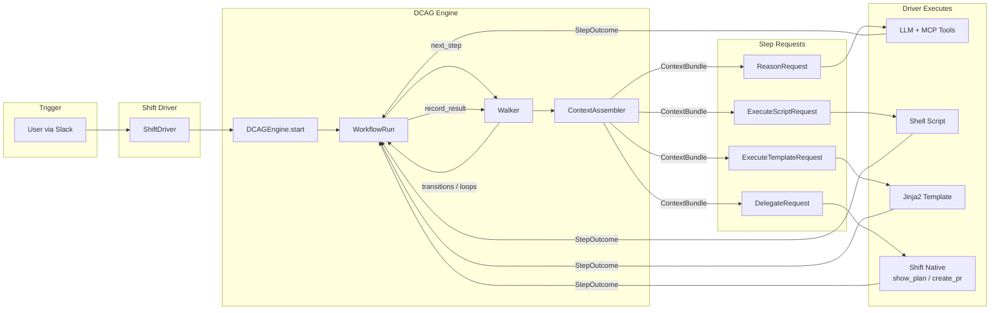
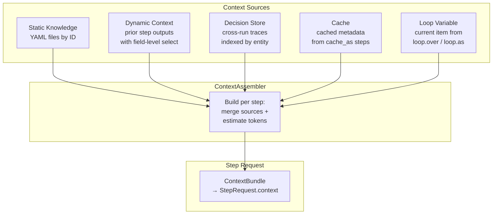

# DCAG Org-Readiness Implementation Plan

> **For agentic workers:** REQUIRED SUB-SKILL: Use superpowers:subagent-driven-development (recommended) or superpowers:executing-plans to implement this plan task-by-task. Steps use checkbox (`- [ ]`) syntax for tracking.

**Goal:** Prepare DCAG for push to StubHub GitHub org with security fixes, CI/CD, linting, developer experience, README rewrite, and architecture diagrams.

**Architecture:** Incremental changes on `feature/org-readiness` branch. Tasks 1-3 are independent and can be parallelized. Tasks 4-5 depend on finalized structure. Task 6 updates CLAUDE.md. Task 7 adds CI/CD. Task 8 is a separate PR to DeveloperPlatformCatalog.

**Tech Stack:** Python 3.11+, FastAPI, ruff, pytest, GitHub Actions, just

**Spec:** `docs/superpowers/specs/2026-03-19-dcag-org-readiness-design.md`

**Branch:** `feature/org-readiness` (already created)

---

### Task 1: Security Fixes

**Files:**
- Modify: `src/dcag/api.py` (lines 35-56 — auth + CORS)
- Modify: `tests/test_api.py` (line 18 — hardcoded credentials)
- Modify: `.gitignore` (line 15 — add .env.example exception)
- Create: `.env.example`

- [ ] **Step 1: Fix CORS configuration in api.py**

Replace lines 50-56 in `src/dcag/api.py`:

```python
# Before (lines 50-56):
app.add_middleware(
    CORSMiddleware,
    allow_origins=["*"],
    allow_credentials=True,
    allow_methods=["*"],
    allow_headers=["*"],
)

# After:
_cors_origins_raw = os.environ.get("DCAG_CORS_ORIGINS", "")
_cors_origins = [o.strip() for o in _cors_origins_raw.split(",") if o.strip()]

app.add_middleware(
    CORSMiddleware,
    allow_origins=_cors_origins or ["*"],
    allow_credentials=bool(_cors_origins),
    allow_methods=["GET", "POST", "OPTIONS"],
    allow_headers=["*"],
)
```

- [ ] **Step 2: Fix auth defaults in api.py**

Replace lines 35-38 in `src/dcag/api.py`:

```python
# Before (lines 35-38):
security = HTTPBasic()
API_USER = os.environ.get("DCAG_API_USER", "dcag")
API_PASS = os.environ.get("DCAG_API_PASS", "dcag-shift-poc")

# After:
_security = HTTPBasic(auto_error=False)
API_USER = os.environ.get("DCAG_API_USER")
API_PASS = os.environ.get("DCAG_API_PASS")

if not API_USER or not API_PASS:
    import warnings
    warnings.warn(
        "DCAG_API_USER and DCAG_API_PASS not set — API auth is DISABLED. "
        "Set both env vars to enable authentication.",
        stacklevel=2,
    )
```

Replace lines 41-47 (verify_auth function):

```python
def verify_auth(credentials: HTTPBasicCredentials | None = Depends(_security)):
    """Verify basic auth credentials. Skips if auth is not configured."""
    if not API_USER or not API_PASS:
        return "anonymous"
    if credentials is None:
        raise HTTPException(status_code=401, detail="Credentials required")
    correct_user = secrets.compare_digest(credentials.username, API_USER)
    correct_pass = secrets.compare_digest(credentials.password, API_PASS)
    if not (correct_user and correct_pass):
        raise HTTPException(status_code=401, detail="Invalid credentials")
    return credentials.username
```

- [ ] **Step 3: Add ExecuteTemplateRequest to API serializer**

Add handling in `_serialize_step` (after the `ExecuteScriptRequest` elif, before the else):

```python
elif isinstance(request, ExecuteTemplateRequest):
    return {
        "mode": "template",
        "step_id": request.step_id,
        "rendered_output": request.rendered_output,
        "artifacts": request.artifacts,
    }
```

Also update the import at line 20-25 to include `ExecuteTemplateRequest`:

```python
from dcag.types import (
    DelegateRequest,
    ExecuteScriptRequest,
    ExecuteTemplateRequest,
    ReasonRequest,
    StepSuccess,
)
```

And update the type hint on `_serialize_step`:

```python
def _serialize_step(request: ReasonRequest | ExecuteTemplateRequest | DelegateRequest | ExecuteScriptRequest) -> dict[str, Any]:
```

- [ ] **Step 4: Update test_api.py to work without hardcoded auth**

In `tests/test_api.py`, replace the entire top of the file (lines 1-18). **CRITICAL: `os.environ.setdefault` MUST come before `from dcag.api import app` because `api.py` reads env vars at module load time.**

```python
"""Unit tests for the DCAG REST API.

Uses FastAPI's TestClient to verify the step-at-a-time enforcement:
- List workflows
- Start a run (get first step)
- Submit results sequentially for all 9 table-optimizer steps
- Verify completed status and full trace
- Error cases: 404 unknown run, 409 wrong step_id
"""
import os
os.environ.setdefault("DCAG_API_USER", "test-user")
os.environ.setdefault("DCAG_API_PASS", "test-pass")

import base64
import pytest
from starlette.testclient import TestClient

from dcag.api import app

client = TestClient(app)
AUTH_HEADER = {"Authorization": "Basic " + base64.b64encode(b"test-user:test-pass").decode()}
```

- [ ] **Step 5: Create .env.example and update .gitignore**

Create `.env.example`:
```
# DCAG API Configuration
DCAG_API_USER=
DCAG_API_PASS=
DCAG_CORS_ORIGINS=http://localhost:3000
```

Add to `.gitignore` after line 15 (`.env.*`):
```
!.env.example
```

- [ ] **Step 6: Run tests to verify security changes**

Run: `.venv/bin/python -m pytest tests/test_api.py -v`
Expected: All API tests pass with new auth setup.

Run: `.venv/bin/python -m pytest -x`
Expected: 361 passed, 1 failed (known xfail — addressed in Task 2), 2 skipped.

- [ ] **Step 7: Commit**

```bash
git add src/dcag/api.py tests/test_api.py .gitignore .env.example
git commit -m "fix: harden API security — CORS, auth, template serialization"
```

---

### Task 2: Linting Config + Coverage + Known Test Fix

**Files:**
- Modify: `pyproject.toml` (add ruff config, coverage thresholds, ruff to dev deps)
- Modify: `tests/test_context.py` (line 44 — add xfail decorator)

- [ ] **Step 1: Add ruff to dev dependencies**

In `pyproject.toml`, add `ruff>=0.4` to the `[project.optional-dependencies] dev` list:

```toml
[project.optional-dependencies]
dev = [
    "pytest>=7.4",
    "pytest-cov>=4.1",
    "ruff>=0.4",
    "fastapi>=0.110",
    "uvicorn>=0.29",
    "httpx>=0.27",
    "requests>=2.31",
]
```

- [ ] **Step 2: Add ruff configuration**

Append to `pyproject.toml`:

```toml
[tool.ruff]
target-version = "py311"
line-length = 100

[tool.ruff.lint]
select = ["E", "F", "I", "UP"]

[tool.ruff.lint.isort]
known-first-party = ["dcag"]
```

- [ ] **Step 3: Add coverage thresholds to pytest config**

Update existing `[tool.pytest.ini_options]`:

```toml
[tool.pytest.ini_options]
testpaths = ["tests"]
pythonpath = ["src"]
addopts = "--cov=dcag --cov-report=term-missing"
```

Note: Current coverage is 92%. Do NOT add `--cov-fail-under` to default addopts (it would slow every test run). CI workflow will enforce the threshold separately.

- [ ] **Step 4: Mark known test failure as xfail**

In `tests/test_context.py`, add decorator to line 44:

```python
@pytest.mark.xfail(reason="engine gracefully degrades (logs warning) instead of raising")
def test_build_dynamic_missing_raises(self, assembler):
    refs = [{"from": "nonexistent", "select": "field"}]
    with pytest.raises(KeyError, match="nonexistent"):
        assembler.build_dynamic(refs, {})
```

- [ ] **Step 5: Install ruff and run lint check**

Run: `.venv/bin/pip install ruff>=0.4`
Run: `.venv/bin/ruff check src/ tests/`

If there are lint errors, fix them. Common ones: unused imports, import ordering.

- [ ] **Step 6: Run full test suite**

Run: `.venv/bin/python -m pytest`
Expected: 361 passed, 1 xfailed, 2 skipped (0 failures).

- [ ] **Step 7: Commit**

```bash
git add pyproject.toml tests/test_context.py
git commit -m "chore: add ruff linting, coverage config, mark known xfail"
```

If lint required source changes:
```bash
git add pyproject.toml tests/test_context.py src/ tests/
git commit -m "chore: add ruff linting, coverage config, fix lint errors, mark known xfail"
```

---

### Task 3: Developer Experience (justfile + pyproject cleanup)

**Files:**
- Create: `justfile`

- [ ] **Step 1: Create justfile**

Create `justfile` at repo root:

```just
# DCAG development commands

# Install package with dev dependencies
setup:
    pip install -e ".[dev]"

# Run all tests
test:
    pytest

# Run tests with coverage report
test-cov:
    pytest --cov=dcag --cov-report=term-missing

# Lint source and tests
lint:
    ruff check src/ tests/

# Format source and tests
fmt:
    ruff format src/ tests/

# Start API server (development)
api:
    uvicorn dcag.api:app --reload --host 0.0.0.0 --port ${DCAG_API_PORT:-8321}

# Run conformance tests only
test-conformance:
    pytest tests/test_conformance_*.py

# Run e2e tests only
test-e2e:
    pytest tests/test_e2e_*.py

# Pre-push check: lint + test
check: lint test
```

- [ ] **Step 2: Verify justfile works**

Run: `just setup` (or verify `just --list` shows all recipes)
Run: `just check`
Expected: lint passes, tests pass (361 passed, 1 xfailed, 2 skipped).

- [ ] **Step 3: Commit**

```bash
git add justfile
git commit -m "chore: add justfile for standard dev commands"
```

---

### Task 4: Architecture Diagrams

**Files:**
- Modify: `docs/architecture.md` (add Mermaid diagrams at top)

- [ ] **Step 1: Add system overview diagram to architecture.md**

Add after the first heading in `docs/architecture.md`, before existing content:

````markdown
## System Overview


````

- [ ] **Step 2: Add context assembly diagram**

Add after the system overview:

````markdown
## Context Assembly (per step)


````

- [ ] **Step 3: Commit**

```bash
git add docs/architecture.md
git commit -m "docs: add Mermaid architecture diagrams"
```

---

### Task 5: README Rewrite

**Files:**
- Modify: `README.md` (full rewrite)

- [ ] **Step 1: Write new README.md**

Full replacement. Use the structure defined in the spec (Section 4). The README must include all of these sections in order:

1. **Header** — `# DCAG — Data Context Abstraction Graph` + one-liner
2. **What is DCAG?** — 3 paragraphs (what it does, core loop, key constraint: no LLM calls)
3. **Architecture** — Embed system overview Mermaid diagram (copy from Task 4), link to `docs/architecture.md`
4. **Available Workflows** — Table of all 10 workflows grouped by persona (AE then DE), columns: Workflow, Persona, Triggers, Model, Steps. Use exact data from spec Section 4.
5. **Quick Start** — `git clone`, `just setup`, `just test`, `just api`
6. **Writing Your Own Workflow** — Full YAML anatomy with annotated example, step modes, context injection explanation, two execution models, checklist for adding a workflow. This is the key section for the broader org audience. Use exact content from spec Section 4.
7. **REST API** — Endpoints table, auth setup, curl examples. Use exact content from spec Section 4.
8. **Integration with Shift** — Brief explanation + link to `docs/shift-integration-guide.md`
9. **Project Structure** — Directory tree with one-line descriptions per module. Use exact content from spec Section 4.
10. **Development** — just commands table, testing categories
11. **Team** — `Owned by **Data Engineering** (@stubhub/data-engineering).`

**Important:**
- The "Writing Your Own Workflow" section is the most important for the target audience. Include the full YAML anatomy, all step modes, all context types (static, dynamic with field-level select, decisions, cache, loop variable), transitions, validation, and the 5-step checklist.
- Keep the README self-contained — someone should understand DCAG without reading other docs.
- Do not include badges (no CI configured yet — Task 7 adds that).

- [ ] **Step 2: Review README for accuracy**

Verify:
- All 10 workflow IDs match `content/workflows/manifest.yml`
- Step counts match actual workflow YAMLs
- Module list matches `src/dcag/`
- API endpoints match `src/dcag/api.py`
- just commands match `justfile` (from Task 3)

- [ ] **Step 3: Commit**

```bash
git add README.md
git commit -m "docs: rewrite README for StubHub org audience"
```

---

### Task 6: Update CLAUDE.md

**Files:**
- Modify: `CLAUDE.md` (update quick reference section)

- [ ] **Step 1: Update quick reference commands**

Update the "Quick Reference" section to use just commands:

```bash
# Run all tests
just test                          # or: pytest

# Run with coverage
just test-cov                      # or: pytest --cov=dcag --cov-report=term-missing

# Lint
just lint                          # or: ruff check src/ tests/

# Format
just fmt                           # or: ruff format src/ tests/

# Pre-push check (lint + test)
just check

# Start API (dev)
just api                           # or: uvicorn dcag.api:app --reload

# Specific test categories
just test-conformance              # Workflow YAML validity
just test-e2e                      # Full workflow execution with fixtures
pytest tests/test_api.py           # REST API endpoints
```

Update known test state to reflect xfail:

```
**Known test state:** All tests pass. `test_context.py::test_build_dynamic_missing_raises` is marked xfail (engine gracefully degrades instead of raising).
```

- [ ] **Step 2: Commit**

```bash
git add CLAUDE.md
git commit -m "docs: update CLAUDE.md with just commands and test state"
```

---

### Task 7: CI/CD Workflows

**Files:**
- Create: `.github/workflows/lint-test-python.yaml`
- Create: `.github/workflows/all-checks-successful.yaml`
- Create: `.github/workflows/claude-pr-review.yaml`

- [ ] **Step 1: Create lint-test-python.yaml**

Create `.github/workflows/lint-test-python.yaml`. Adapted from the Astronomer `dataplatform_lint-test-python.yaml` but simplified (no dbt deps, no Snowflake creds, no path filtering needed for a small repo):

```yaml
name: Lint/Test - Python

on:
  pull_request:
    types: [opened, reopened, synchronize]
    branches:
      - main

permissions:
  pull-requests: read
  contents: read

jobs:
  lint_python:
    name: Lint Python
    runs-on: sh-ubuntu-1x
    steps:
      - name: Checkout
        uses: actions/checkout@v4

      - name: Set up Python
        uses: actions/setup-python@v5
        with:
          python-version: "3.11"
          cache: pip

      - name: Install dependencies
        run: pip install -e ".[dev]"

      - name: Lint
        run: ruff check src/ tests/

  test_python:
    name: Test Python
    runs-on: sh-ubuntu-2x
    steps:
      - name: Checkout
        uses: actions/checkout@v4

      - name: Set up Python
        uses: actions/setup-python@v5
        with:
          python-version: "3.11"
          cache: pip

      - name: Install dependencies
        run: pip install -e ".[dev]"

      - name: Run tests
        run: pytest --cov=dcag --cov-report=term-missing --cov-fail-under=85
        env:
          DCAG_API_USER: test-user
          DCAG_API_PASS: test-pass
```

- [ ] **Step 2: Copy all-checks-successful.yaml**

**Prerequisite:** You need the DeveloperPlatformCatalog repo cloned at `/Users/sundar.velayutham/code/DeveloperPlatformCatalog`.

```bash
cp /Users/sundar.velayutham/code/DeveloperPlatformCatalog/standard_github_workflows/all-checks-successful.yaml .github/workflows/all-checks-successful.yaml
```

No modifications needed — it's a standard aggregator that checks all CI runs and reports overall status.

- [ ] **Step 3: Copy claude-pr-review.yaml**

```bash
cp /Users/sundar.velayutham/code/DeveloperPlatformCatalog/standard_github_workflows/claude-pr-review.yaml .github/workflows/claude-pr-review.yaml
```

No modifications needed — it reads CLAUDE_PR_PROMPT.md if present, otherwise uses default review prompt. Uses `anthropics/claude-code-action@v1.0.29`.

- [ ] **Step 4: Create .github directory structure**

Run: `mkdir -p .github/workflows`

- [ ] **Step 5: Commit**

```bash
git add .github/workflows/lint-test-python.yaml .github/workflows/all-checks-successful.yaml .github/workflows/claude-pr-review.yaml
git commit -m "ci: add GitHub Actions for lint, test, and Claude PR review"
```

---

### Task 8: DeveloperPlatformCatalog Registration (Separate Repo)

**Files:**
- Modify: `/Users/sundar.velayutham/code/DeveloperPlatformCatalog/catalog_entries/GithubRepository.yaml`

**Note:** This is a separate PR to the DeveloperPlatformCatalog repo, NOT part of the DCAG branch.

- [ ] **Step 1: Create branch in DeveloperPlatformCatalog**

```bash
cd /Users/sundar.velayutham/code/DeveloperPlatformCatalog
git checkout main && git pull
git checkout -b feature/add-dcag-repo
```

- [ ] **Step 2: Add catalog entry**

Add in alphabetical order (after `StubHub.Data.Core.*` entries, before `StubHub.Data.Insights.*`):

```yaml
  - Name: StubHub.Data.Core.ContextAbstractionGraph
    Description: Headless workflow engine for AI-assisted data engineering investigations and pipeline builds
    Teams:
      - Data Engineering
    Default Branch: main
    URL: https://github.com/stubhub/StubHub.Data.Core.ContextAbstractionGraph
    Topics:
      - Data Platform
      - Engineering
    Enable Claude PR Reviews: true
```

- [ ] **Step 3: Validate entry**

Run: `make validate-entries` (if available) or `make sort-entries`
Expected: No errors. Entry is in correct alphabetical position.

- [ ] **Step 4: Commit and push**

```bash
git add catalog_entries/GithubRepository.yaml
git commit -m "feat: register StubHub.Data.Core.ContextAbstractionGraph"
git push -u origin feature/add-dcag-repo
```

- [ ] **Step 5: Create PR and post in Slack**

Create PR to DeveloperPlatformCatalog. Post link in #platform-team tagging @platform-devops for review.

---

## Parallelization Guide

```
Tasks 1, 2, 3 → independent, can run in parallel
Task 4 → independent (only touches docs/architecture.md)
Task 5 → depends on Task 3 (references just commands) and Task 4 (embeds diagram)
Task 6 → depends on Task 2 (references test state) and Task 3 (references just commands)
Task 7 → depends on Task 2 (ruff config must exist for CI lint step)
Task 8 → fully independent (separate repo)
```

Recommended parallel groups:
- **Group A (parallel):** Tasks 1 + 2 + 3 + 4 + 8
- **Group B (parallel, after Group A):** Tasks 5 + 6 + 7 (all depend on Group A, but not on each other)
