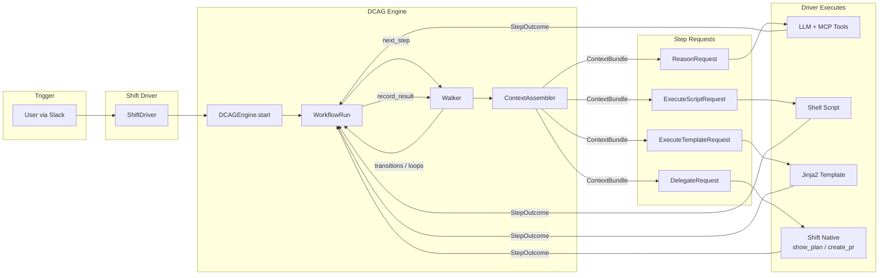
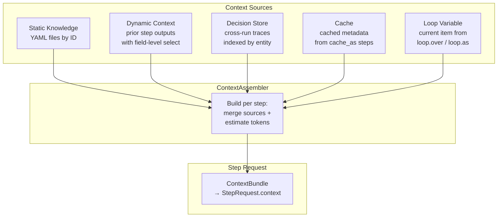

# DCAG Org-Readiness Design Spec

**Date:** 2026-03-19
**Status:** Approved
**Goal:** Prepare StubHub.Data.Core.ContextAbstractionGraph for push to stubhub GitHub org, targeting broader engineering audience (other teams may build their own workflows or integrate DCAG).

---

## Current State

DCAG is a headless workflow engine with:
- 10 workflows (77 total steps), 25+ knowledge files, 2 personas
- 14 Python modules (~1860 lines), clean separation of concerns
- 364 tests (361 passing, 1 known failure, 2 skipped)
- Extensive documentation (README, architecture.md, shift-integration-guide.md, 32 design/research docs)
- Tested live via Shift on 2026-03-12 (table-optimizer, add-column-to-model, add-dbt-tests, fix-model-bug)

## Target Audience

Broader StubHub engineering org. Other teams will:
- Build their own workflow YAMLs for their domains
- Integrate DCAG via REST API or Shift driver
- Need clear onboarding, extension points, and API docs

---

## Section 1: Security Fixes

### 1a. CORS Configuration (`src/dcag/api.py`)

**Problem:** `allow_origins=["*"]` with `allow_credentials=True` violates CORS spec and exposes credentials to all origins.

**Fix:**
```python
# Before
app.add_middleware(
    CORSMiddleware,
    allow_origins=["*"],
    allow_credentials=True,
    allow_methods=["*"],
    allow_headers=["*"],
)

# After
_origins = os.environ.get("DCAG_CORS_ORIGINS", "").split(",")
_origins = [o.strip() for o in _origins if o.strip()]

app.add_middleware(
    CORSMiddleware,
    allow_origins=_origins or ["*"],
    allow_credentials=bool(_origins),  # only with explicit origins
    allow_methods=["GET", "POST", "OPTIONS"],
    allow_headers=["*"],
)
```

When no `DCAG_CORS_ORIGINS` is set: wildcard origins, no credentials (safe default).
When set (e.g., `http://localhost:3000,https://shift.stubhub.com`): explicit origins with credentials.

### 1b. Auth Defaults (`src/dcag/api.py`)

**Problem:** Hardcoded fallback `dcag`/`dcag-shift-poc` means API runs without explicit credential setup.

**Fix:**
```python
# Before
_USER = os.environ.get("DCAG_API_USER", "dcag")
_PASS = os.environ.get("DCAG_API_PASS", "dcag-shift-poc")

# After
_USER = os.environ.get("DCAG_API_USER")
_PASS = os.environ.get("DCAG_API_PASS")

if not _USER or not _PASS:
    import warnings
    warnings.warn(
        "DCAG_API_USER and DCAG_API_PASS not set — API auth is DISABLED. "
        "Set both env vars to enable authentication.",
        stacklevel=2,
    )
```

When env vars are missing: auth is disabled with a loud warning (useful for local dev).
When set: HTTP Basic auth enforced.

Update the auth dependency to skip verification when credentials are not configured, so local development works without `.env`.

### 1c. `.env.example`

New file at repo root. **Note:** `.gitignore` contains `.env.*` which matches `.env.example` — add `!.env.example` to `.gitignore` to ensure this file is committed.

```
# DCAG API Configuration
DCAG_API_USER=
DCAG_API_PASS=
DCAG_CORS_ORIGINS=http://localhost:3000
```

---

## Section 2: CI/CD & Linting

### 2a. GitHub Actions Workflows

Copy from DeveloperPlatformCatalog standard templates into `.github/workflows/`:

| Workflow | Source | Purpose |
|----------|--------|---------|
| `dataplatform_lint-test-python.yaml` | `standard_github_workflows/` | ruff + pytest on PR/push |
| `all-checks-successful.yaml` | `standard_github_workflows/` | Aggregate CI results |
| `claude-pr-review.yaml` | `standard_github_workflows/` | AI-powered PR reviews |

Adapt `dataplatform_lint-test-python.yaml` for DCAG's structure:
- Python version: 3.11
- Install: `pip install -e ".[dev]"`
- Lint: `ruff check src/ tests/`
- Test: `pytest --cov=dcag --cov-fail-under=85`

### 2b. Ruff Configuration (`pyproject.toml`)

```toml
[tool.ruff]
target-version = "py311"
line-length = 100

[tool.ruff.lint]
select = ["E", "F", "I", "UP"]

[tool.ruff.lint.isort]
known-first-party = ["dcag"]
```

Rules:
- `E` — pycodestyle errors
- `F` — pyflakes
- `I` — isort (import sorting)
- `UP` — pyupgrade (Python 3.11+ idioms)

### 2c. Coverage Thresholds (`pyproject.toml`)

```toml
[tool.pytest.ini_options]
testpaths = ["tests"]
pythonpath = ["src"]
addopts = "--cov=dcag --cov-report=term-missing --cov-fail-under=85"
```

**Important:** Run `pytest --cov=dcag --cov-report=term-missing` first to measure baseline before committing to a threshold. 85% is the target — adjust if baseline is lower.

### 2d. Fix Known Test Failure

In `tests/test_context.py`, mark the known failure:
```python
@pytest.mark.xfail(reason="engine gracefully degrades (logs warning) instead of raising")
def test_build_dynamic_missing_raises(self):
    ...
```

This makes CI green while documenting the intentional behavior divergence.

---

## Section 3: Developer Experience

### 3a. `justfile`

```just
# DCAG development commands

# Install package with dev dependencies
setup:
    pip install -e ".[dev]"

# Run all tests
test:
    pytest

# Run tests with coverage report
test-cov:
    pytest --cov=dcag --cov-report=term-missing

# Lint source and tests
lint:
    ruff check src/ tests/

# Format source and tests
fmt:
    ruff format src/ tests/

# Start API server (development)
api:
    uvicorn dcag.api:app --reload --host 0.0.0.0 --port 8321

# Run conformance tests only
test-conformance:
    pytest tests/test_conformance_*.py

# Run e2e tests only
test-e2e:
    pytest tests/test_e2e_*.py

# Pre-push check: lint + test
check: lint test
```

### 3b. Dev Extras in `pyproject.toml`

```toml
[project.optional-dependencies]
dev = [
    "pytest>=7.4",
    "pytest-cov>=4.1",
    "ruff>=0.4",
    "fastapi>=0.110",
    "uvicorn>=0.29",
    "httpx>=0.27",
    "requests>=2.31",
]
```

Add `ruff>=0.4` to the existing `[project.optional-dependencies] dev` list. Core dependencies are already correctly separated (`pyyaml`, `jinja2`, `jsonschema`).

---

## Section 4: README Rewrite

Full README.md rewrite targeting broader org audience. Structure:

### Header
```markdown
# DCAG — Data Context Abstraction Graph

Headless workflow engine for AI-assisted data engineering.
```

### What is DCAG?
Three paragraphs:
1. DCAG structures how AI assistants investigate and resolve data engineering problems
2. Core loop: engine loads workflow YAML → emits typed step requests → driver executes → engine records results and advances
3. Key constraint: DCAG makes NO LLM calls itself. The engine is a pure orchestrator. Drivers (like Shift) handle execution.

### Architecture
Embed Mermaid diagram #1 (System Overview) inline. Link to `docs/architecture.md` for deep dive.

### Available Workflows
Table grouped by persona:

| Workflow | Persona | Triggers | Model | Steps |
|----------|---------|----------|-------|-------|
| triage-ae-alert | AE | `triage`, `on-call`, `debug alert` | Full orchestration | 13 (4-way branch) |
| fix-model-bug | AE | `fix bug`, `model failing` | Full orchestration | 8 (3-way branch) |
| add-column-to-model | AE | `add column`, `new column` | Full orchestration | 9 |
| add-dbt-tests | AE | `add tests`, `test coverage` | Full orchestration | 7 |
| generate-schema-yml | AE | `generate schema`, `document model` | Full orchestration | 6 |
| create-staging-model | AE | `create staging`, `new source` | Full orchestration | 8 |
| thread-field-through-pipeline | AE | `thread column`, `propagate column` | Full orchestration | 7 (2 loops) |
| create-etl-pipeline | DE | `create pipeline`, `new pipeline` | Guardrails | 11 (4-way branch + revision loop) |
| table-optimizer | DE | `optimize table`, `clustering` | Full orchestration | 9 |
| configure-ingestion-pipeline | DE | `add ingestion`, `new data source` | Full orchestration | 7 |

### Quick Start
```bash
# Prerequisites: Python 3.11+
git clone https://github.com/stubhub/StubHub.Data.Core.ContextAbstractionGraph.git
cd StubHub.Data.Core.ContextAbstractionGraph
just setup        # or: pip install -e ".[dev]"
just test         # or: pytest
just api          # starts REST API on :8321
```

### Writing Your Own Workflow

**Workflow YAML anatomy:**
```yaml
workflow:
  id: my-workflow
  name: Human-Readable Name
  persona: analytics_engineer  # or data_engineer
  inputs:
    param_name:
      type: string
      required: true
  steps:
    - id: step_one
      mode: reason              # reason | execute | delegate
      instruction: |
        What the LLM should do...
      tools:                    # tool gate — only these tools allowed
        - name: snowflake_mcp.execute_query
          instruction: "Why to use this tool"
      context:
        static: [knowledge_id]  # domain knowledge YAMLs
        dynamic:                # prior step outputs
          - from: prior_step_id
            select: [field1, field2]
        decisions:              # cross-run decision traces
          - entity: "{{inputs.table_name}}"
        cache: [cache_key]      # cached metadata
      output_schema:
        type: object
        required: [field1]
      budget:
        max_llm_turns: 5
        max_tokens: 10000
      transitions:              # conditional routing
        - when: "output.type == 'error'"
          goto: handle_error
        - default: next_step
      validation:
        structural:
          - output_has: field1
      loop:                     # iterate over collection
        over: "prior_step.items"
        as: "item"
```

**Step modes:**
- `reason` — LLM reasoning with context, tools, and output schema
- `execute` — Script execution or Jinja2 template rendering
- `delegate` — Driver-native capability (show_plan, create_pr)

**Context injection (per step):**
- `static` — Knowledge YAML files loaded by ID
- `dynamic` — Prior step outputs with field-level selection (`from:` + `select:`)
- `decisions` — Cross-run decision traces indexed by entity
- `cache` — Cached metadata from `cache_as:` steps

**Two execution models:**
- **Full orchestration** — Step-by-step with tool gates. Best for ops (triage, monitoring, validation).
- **Guardrails** — Context assembly → one freestyle step → mandatory validation. Best for creative work (pipeline creation, schema evolution).

**Checklist for adding a workflow:**
1. Create `content/workflows/{id}.yml`
2. Create `content/workflows/{id}.test.yml` (mock step outputs)
3. Add entry to `content/workflows/manifest.yml`
4. Add `tests/test_conformance_{id}.py`
5. Add `tests/test_e2e_{id}.py`
6. Run `just test` — all tests must pass

### REST API

| Method | Endpoint | Description |
|--------|----------|-------------|
| GET | `/api/v1/workflows` | List available workflows |
| POST | `/api/v1/runs` | Start a new run; returns first step request |
| POST | `/api/v1/runs/{run_id}/results` | Submit step result; returns next step request |
| GET | `/api/v1/runs/{run_id}` | Get run status and trace |

Auth: HTTP Basic (set `DCAG_API_USER` and `DCAG_API_PASS` env vars).

```bash
# Start a run
curl -u $DCAG_API_USER:$DCAG_API_PASS \
  -X POST http://localhost:8321/api/v1/runs \
  -H "Content-Type: application/json" \
  -d '{"workflow_id": "table-optimizer", "inputs": {"table_name": "DW.RPT.TRANSACTION"}}'

# Submit step result
curl -u $DCAG_API_USER:$DCAG_API_PASS \
  -X POST http://localhost:8321/api/v1/runs/{run_id}/results \
  -H "Content-Type: application/json" \
  -d '{"step_id": "identify_table", "status": "success", "output": {...}}'
```

See `docs/shift-integration-guide.md` for full integration details.

### Integration with Shift

DCAG integrates with Shift (StubHub's Slack AI assistant) via two modes:
- **Level 1 (YAML-direct):** Shift reads workflow YAML and executes step-by-step. Tested in production.
- **Level 2 (REST API):** Step-at-a-time HTTP enforcement. Built, networking integration pending.

See `docs/shift-integration-guide.md`.

### Project Structure
```
src/dcag/
├── engine.py          # Entry point: DCAGEngine + WorkflowRun
├── types.py           # Type contracts: StepRequest, StepOutcome, ContextBundle
├── _walker.py         # DAG traversal, transitions, loops
├── _context.py        # Context assembly (static + dynamic + decisions + cache)
├── _loaders.py        # YAML parsing into typed dataclasses
├── _evaluator.py      # Transition expression evaluation
├── _validation.py     # Structural output validation
├── _trace.py          # JSONL streaming trace
├── _decisions.py      # Cross-run decision persistence
├── _registry.py       # Tool filtering by runtime capabilities
├── _snapshot.py       # Context snapshots for observability
├── _tokens.py         # Token estimation
├── api.py             # FastAPI REST wrapper
└── drivers/shift.py   # Shift integration driver

content/
├── workflows/         # 10 workflow YAMLs + test fixtures + manifest
├── knowledge/         # 25+ domain knowledge files
└── personas/          # analytics_engineer, data_engineer

tests/                 # 364 tests: conformance, e2e, unit, API, driver, integration
docs/                  # Architecture, integration guide, design specs, research
```

### Development

```bash
just setup             # Install with dev dependencies
just test              # Run all tests
just test-cov          # Tests with coverage report
just lint              # Lint with ruff
just fmt               # Format with ruff
just api               # Start dev API server
just test-conformance  # Conformance tests only
just test-e2e          # E2E tests only
```

### Team

Owned by **Data Engineering** (`@stubhub/data-engineering`).

---

## Section 5: Architecture Diagrams

Two Mermaid diagrams added to `docs/architecture.md` and the System Overview embedded in README.

### Diagram 1: System Overview



### Diagram 2: Context Assembly (per step)



---

## Section 6: DeveloperPlatformCatalog Registration

Entry to add to `DeveloperPlatformCatalog/catalog_entries/GithubRepository.yaml` (alphabetical order):

```yaml
- Name: StubHub.Data.Core.ContextAbstractionGraph
  Description: Headless workflow engine for AI-assisted data engineering investigations and pipeline builds
  Teams:
    - Data Engineering
  Default Branch: main
  URL: https://github.com/stubhub/StubHub.Data.Core.ContextAbstractionGraph
  Topics:
    - Data Platform
    - Engineering
  Enable Claude PR Reviews: true
```

**Process:**
1. Branch `feature/add-dcag-catalog-entry` in DeveloperPlatformCatalog repo
2. Add entry in alphabetical position
3. Open PR
4. Post in #platform-team tagging @platform-devops
5. CI validates (`make validate-entries`, `make sort-entries`)
6. Merge → automation creates CODEOWNERS, applies settings

**Note:** This is a separate PR to the DeveloperPlatformCatalog repo, not part of the DCAG repo changes.

---

## Implementation Order

| Step | Deliverable | Repo |
|------|-------------|------|
| 1 | Security fixes (CORS, auth) + `.env.example` + `.gitignore` update | DCAG |
| 2 | Linting config (ruff) + coverage thresholds + `xfail` known test | DCAG |
| 3 | Dev extras in `pyproject.toml` + `justfile` | DCAG |
| 4 | Architecture diagrams in `docs/architecture.md` | DCAG |
| 5 | README rewrite | DCAG |
| 6 | Update `CLAUDE.md` to reflect new commands | DCAG |
| 7 | CI/CD workflows in `.github/workflows/` | DCAG |
| 8 | Catalog registration PR | DeveloperPlatformCatalog |

Steps 1-3 can be parallelized. Steps 4-5 depend on finalized structure. Step 7 depends on linting config (step 2). Step 8 is independent (separate repo).

---

## Out of Scope

- Full docstring coverage (code is readable and well-tested)
- OpenAPI spec generation (FastAPI auto-generates at `/docs` when running)
- CONTRIBUTING.md (README workflow authoring guide covers this)
- mypy type checking (would require separate annotation pass)
- SECURITY.md (org-level policy)
